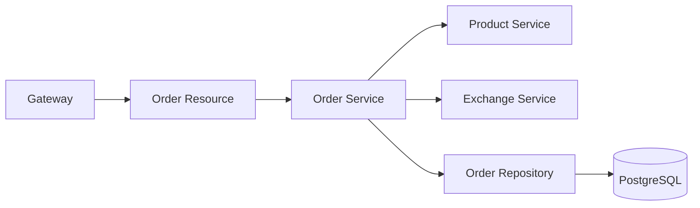

# Architecture

## Persistence

Flyway creates the `orders` schema with `orders.orders` and `orders.order_items`.

## Service Calls

OpenFeign clients call Product Service and Exchange Service using URLs injected through `PRODUCT_SERVICE_URL` and `EXCHANGE_SERVICE_URL`.
